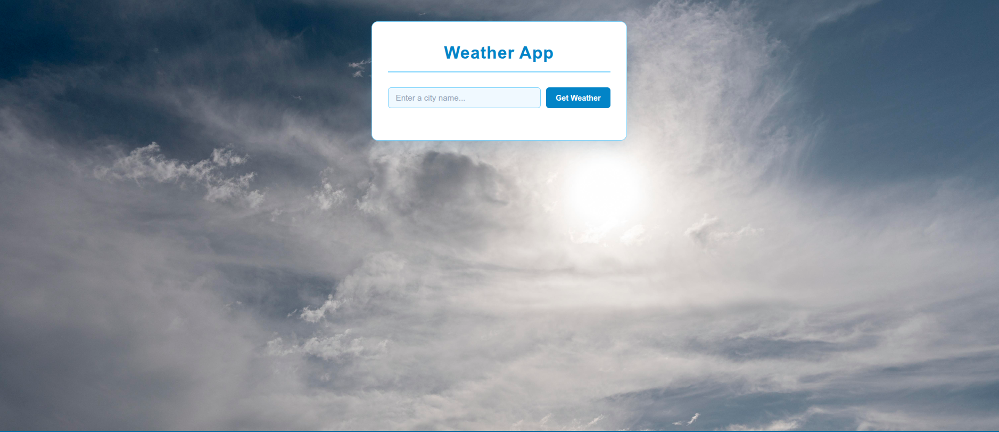
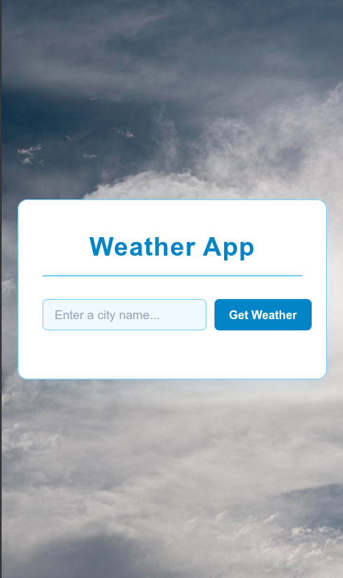

# Weather App 🧊🌤️

[](https://your-weather-app.vercel.app)
[](https://developer.mozilla.org/en-US/docs/Web/JavaScript)
[](https://openweathermap.org/api)

## Overview

A simple, responsive **Weather App** built with vanilla HTML, CSS, and JavaScript. Enter any city name to get real-time weather data including temperature, description, humidity, and wind speed. Automatically saves the **10 most recent searches** in a convenient table below for quick reference.

Perfect for learning modern JavaScript (async/await, DOM manipulation, local state management) and responsive design.

## ✨ Features

| Feature | Description |
|---------|-------------|
| **🔍 City Search** | Search weather by city name (Enter key or button) |
| **📊 Live Data** | Real-time data from OpenWeatherMap API (°C metric) |
| **📈 History Table** | Auto-saves 10 most recent searches with timestamp |
| **🎨 Responsive** | Works perfectly on desktop, tablet, mobile |
| **⚡ Loading States** | Smooth spinner + error handling for invalid cities |
| **🧹 Clear Results** | One-click to reset current results |
| **💫 Animations** | Hover effects, smooth transitions |
| **🌅 Themed UI** | Beautiful gradient background + weather icons |

## 🎬 Live Demo

Simply open `index.html` in your browser!

```
# Quick local preview
open index.html
# Or use VSCode Live Server extension
```

**Try these cities:** London, Tokyo, New York, Sydney, Lagos

## 🚀 Quick Start

1. **Clone/Download** this repo
2. **Open** `index.html` in any modern browser
3. **Enter** a city name and hit **Get Weather** 🎉

No build tools, no dependencies, no installation required!

## 🛠 Tech Stack

- **Frontend:** Vanilla HTML5, CSS3, JavaScript (ES6+)
- **API:** [OpenWeatherMap](https://openweathermap.org/api) (free tier)
- **Icons:** Font Awesome
- **Responsive:** CSS Flexbox + Media Queries
- **Bundle Size:** ~5KB (zero dependencies!)

## 📱 How It Works

```
1. User enters city → Click/Enter
2. JS fetches: `https://api.openweathermap.org/data/2.5/weather`
3. Displays: Temp (°C), Description, Humidity (%), Wind (m/s)
4. Saves to history array (max 10 entries)
5. Renders table with S/N, Date, Time, Data
```

**Key JS Concepts Used:**
- `async/await` + `fetch()` API
- DOM manipulation (`querySelector`, `classList`)
- Event listeners (`click`, `keydown`)
- Array methods (`unshift`, `slice`)
- Dynamic table generation

## 📸 Screenshots

### Desktop View


### Mobile View



## 🔑 API Configuration

The app uses a **free OpenWeatherMap API key** (bundled in `weather.js`).

**To use your own key:**
```javascript
// weather.js line 1
const API_KEY = 'YOUR_API_KEY_HERE';
```

**Get free key:** [openweathermap.org](https://openweathermap.org/api)

⚠️ **Note:** History resets on page reload (stored in memory). Add `localStorage` for persistence!

## 🚀 Enhancements Ideas

- [ ] Save history to `localStorage`
- [ ] Weather forecast (5-day)
- [ ] Geolocation (current location)
- [ ] Unit toggle (°C/°F)
- [ ] Dark/Light mode
- [ ] PWA (offline support)

## 🤝 Contributing

1. Fork the repo
2. Create feature branch (`git checkout -b feature/cool-feature`)
3. Commit changes (`git commit -m 'Add cool feature'`)
4. Push (`git push origin feature/cool-feature`)
5. Open Pull Request

## 📄 License

This project is [MIT](LICENSE) licensed - use for personal & commercial purposes.

---

⭐ **Star the repo if you found it helpful!** ⭐

**Made with ❤️ using Vanilla JS** | [Demo](https://your-weather-app.vercel.app)

